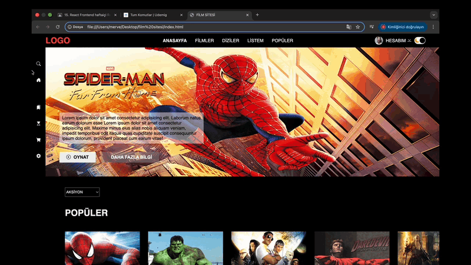

<h1> FİLM SİTESİ </h1>
🎬 Film Sitesi
Basit ve temiz bir ön yüz HTML/CSS ile hazırlanmış film temalı web sitesi projesi.
Film Sitesi, HTML ve CSS kullanılarak oluşturulmuş örnek bir web sayfasıdır. Bu proje, temel web geliştirme becerilerimi göstermek için yapılan bir ders/ödev projesidir.
📸 Önizleme
�
🚀 Genel Bakış
Bu proje ile:
Modern bir film sitesi teması tasarlandı
Kullanıcı arayüzü basit ve kullanıcı dostu tutuldı
HTML & CSS bilgisi pekiştirildi
🛠 Özellikler
🧱 HTML5 yapısı
🎨 Modern CSS tasarımı
📱 Responsive (temel) düzen
👁 Görsel önizleme
📁 Proje İçeriği
Aşağıdaki dosya ve klasörler projenin temelini oluşturur:
Kodu kopyala

├── index.html
├── style.css
├── img/
│   └── ekran.gif
💻 Nasıl Kullanılır
Projeyi klonlayarak kendi bilgisayarında açabilirsin:
Terminal / Komut istemcisini aç
Depoyu klonla:
Bash
Kodu kopyala
git clone https://github.com/Gezgin12-svg/film-sitesi.git
Proje klasörüne gir:
Bash
Kodu kopyala
cd film-sitesi
index.html dosyasını tarayıcıda aç — sayfa görüntülenecektir.
🧪 Gereksinimler
Bu proje herhangi bir ek kurulum gerektirmez — sadece bir web tarayıcısı yeterlidir.
📌 Kullanım Alanı
Bu site örnektir; portföy, ders ödevi, başlangıç web projeleri için uygundur.
📝 Lisans
Bu proje özgür bir şekilde kullanılabilir ve kişisel/ödev amaçlı geliştirilebilir.
<h2>Ekran görüntüsü </h2>

